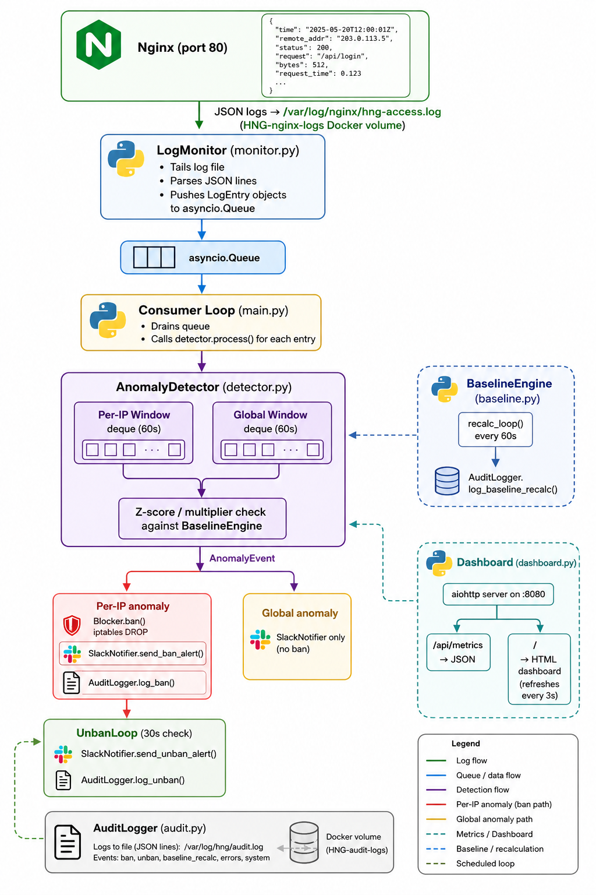

# HNG Anomaly Detection Engine

> Real-time DDoS and anomaly detection for cloud.ng (Nextcloud) — built for HNG DevSecOps internship.

[]()
[]()

---

## Language Choice

**Python 3.12** — chosen because:
- `asyncio` gives us native non-blocking I/O for log tailing and concurrent tasks without threads.
- `collections.deque` provides O(1) append/popleft — exactly what a sliding window needs.
- `aiohttp` powers both the Slack webhook client and the dashboard web server in the same event loop.
- `psutil` gives cross-platform CPU/memory metrics with zero extra dependencies.
- Python's readability makes the detection logic auditable — every threshold decision is traceable to a line of code.

---

## Architecture Overview



---

## How the Sliding Window Works

### Deque Structure

Each `SlidingWindow` object wraps a `collections.deque` that stores **raw Unix timestamps** (float), one per request:

```python
self._events: deque = deque()        # All requests
self._error_events: deque = deque()  # 4xx/5xx only
```

### Insertion

```python
def add(self, ts: float, is_error: bool = False):
    self._events.append(ts)
    if is_error:
        self._error_events.append(ts)
```

O(1) amortized — deques append to the right in constant time.

### Eviction Logic

```python
def _evict(self, now: float):
    cutoff = now - self.window_seconds  # e.g., now - 60
    while self._events and self._events[0] < cutoff:
        self._events.popleft()          # O(1) per removal
```

We pop from the **left** while the leftmost (oldest) timestamp is outside the window. Because timestamps are inserted in chronological order, the deque is always sorted — so we stop as soon as we hit a timestamp inside the window. This is O(k) where k = number of expired entries (typically 0–5 per call).

### Rate Computation

```python
def rate(self, now=None) -> float:
    self._evict(now or time.time())
    return len(self._events) / self.window_seconds
```

`len(deque)` is O(1) in Python. So a complete rate check is O(k) — practically O(1) in steady state.

**Why raw timestamps instead of per-second buckets?**
Per-second buckets drift at window boundaries (e.g., a burst in the last 0.5 seconds of a bucket gets counted in a new bucket). Raw timestamps give us exact counts at any sub-second granularity.

---

## How the Baseline Works

### Rolling 30-Minute Window

`BaselineEngine` maintains a `deque(maxlen=1800)` — one slot per second for 30 minutes. Each slot is `(unix_second, req_count, err_count)`.

```python
self._rolling: deque = deque(maxlen=self.rolling_window_seconds)
```

`maxlen` enforces the window automatically: when we append a new slot, Python evicts the oldest one from the left at no extra cost.

### Accumulation

Every incoming request calls `record_request(ts, is_error)`. We accumulate counts in `_current_second` / `_current_req`. When the second ticks over, we flush the completed slot into `_rolling` and into the per-hour slot.

### Recalculation (every 60 seconds)

```python
roll_mean = sum(counts) / n
roll_variance = sum((c - roll_mean)**2 for c in counts) / n
roll_stddev = math.sqrt(roll_variance)
```

This is **population** stddev (we have the full window, not a sample).

### Per-Hour Slots

We maintain 24 `HourlySlot` objects. Each slot accumulates the same per-second buckets for its clock hour. On recalculation:

1. Compute stats from the 30-min rolling window (baseline default).
2. Compute stats from the current clock hour's slot.
3. If the current hour has ≥ 10 samples (`min_samples`), **prefer the hourly stats** — they reflect today's actual traffic pattern for this time of day.
4. Apply floor values: `effective_mean = max(mean, 1.0)`, `effective_stddev = max(stddev, 0.5)`.

### Why This Matters

Traffic at 3am is different from traffic at 2pm. Using hourly slots means the baseline *adapts to diurnal patterns* — a spike at 3am is judged against 3am norms, not the 24-hour average.

Floor values (`floor_mean=1.0`, `floor_stddev=0.5`) ensure we never divide by zero or flag a single request as a 6-sigma event when the server just started.

---

## Detection Logic

```
is_anomalous(rate, stats, z_thresh, mult) → (bool, condition)

  z_score = (rate - stats.effective_mean) / stats.effective_stddev

  if z_score > z_thresh:        → anomaly ("zscore=X.X>3.0")
  if rate > mult × mean:        → anomaly ("rate=X.X>5x_mean(Y.Y)")
```

**Z-score** catches sustained elevated rates. The multiplier catches **sudden bursts** that might not yet be reflected in stddev (e.g., the first 5 seconds of a flood).

### Error Rate Tightening

```python
if ip_err_rate > 3× baseline_error_rate_mean:
    z_thresh = 2.0      # Lower threshold (more sensitive)
    mult = 3.0          # Tighter multiplier
```

An IP generating many 4xx/5xx errors (scanners, brute-force tools) gets flagged at a lower rate threshold.

### Cooldown

Each IP has a 60-second anomaly cooldown. This prevents one attacker from triggering 1000 alerts per second. The *first* anomaly fires the ban; subsequent detections during the cooldown are suppressed.

---

## iptables Blocking

When a per-IP anomaly is detected:

```bash
iptables -I INPUT 1 -s <IP> -j DROP
```

We insert at position **1** (top of INPUT chain) to guarantee the rule is evaluated before any ACCEPT rules. The IP's traffic is silently dropped at the kernel level — Nginx never sees it.

**Unban:**
```bash
iptables -D INPUT -s <IP> -j DROP
```

**Ban schedule (backoff):** 10 min → 30 min → 2 hours → permanent.

Each ban escalates to the next tier based on the IP's cumulative ban count in the current session. Repeat offenders are banned longer each time.

---

## Setup: Fresh VPS to Running Stack

### 1. Provision the VPS

Minimum: 2 vCPU, 2 GB RAM. Ubuntu 22.04 LTS recommended.

```bash
# Update and install Docker
sudo apt-get update && sudo apt-get upgrade -y
sudo apt-get install -y ca-certificates curl gnupg

curl -fsSL https://download.docker.com/linux/ubuntu/gpg \
  | sudo gpg --dearmor -o /etc/apt/keyrings/docker.gpg

echo "deb [arch=$(dpkg --print-architecture) \
  signed-by=/etc/apt/keyrings/docker.gpg] \
  https://download.docker.com/linux/ubuntu \
  $(lsb_release -cs) stable" \
  | sudo tee /etc/apt/sources.list.d/docker.list

sudo apt-get update
sudo apt-get install -y docker-ce docker-ce-cli containerd.io docker-compose-plugin
```

### 2. Clone the Repository

```bash
git clone https://github.com/Samuelhetty/hng-anomaly-detector.git
```

### 3. Configure Environment

```bash
cp .env.example .env
nano .env
# Fill in: SERVER_IP, passwords, SLACK_WEBHOOK_URL
```

### 4. Open Firewall Ports

```bash
sudo ufw allow 22/tcp    # SSH
sudo ufw allow 80/tcp    # Nextcloud (HTTP)
sudo ufw allow 8080/tcp  # Metrics dashboard
sudo ufw enable
```

### 5. Start the Stack

```bash
docker compose up -d
```

### 6. Verify

```bash
# Check all containers are up
docker compose ps

# Tail detector logs
docker compose logs -f detector

# Check nginx is writing JSON logs
docker compose exec nginx tail -f /var/log/nginx/hng-access.log

# View iptables (run on host)
sudo iptables -L INPUT -n --line-numbers
```

### 7. Access the Dashboard

Open `http://YOUR_SERVER_IP:8080` in a browser.

---

## Repository Structure

```
hng-anomaly-detector/
├── detector/
│   ├── main.py          # Daemon entrypoint, wires all components
│   ├── monitor.py       # Log file tailer and JSON parser
│   ├── baseline.py      # Rolling baseline computation
│   ├── detector.py      # Sliding window + anomaly detection
│   ├── blocker.py       # iptables ban management
│   ├── unbanner.py      # Audit logging (ban/unban/recalc events)
│   ├── notifier.py      # Slack webhook notifications
│   ├── dashboard.py     # aiohttp web dashboard server
│   ├── config.yaml      # All thresholds and settings
│   ├── requirements.txt
│   └── Dockerfile
├── nginx/
│   └── nginx.conf       # JSON logging + reverse proxy config
├── docs/
│   └── architecture.png
├── screenshots/
│   ├── Tool-running.png
│   ├── Ban-slack.png
│   ├── Unban-slack.png
│   ├── Global-alert-slack.png
│   ├── Iptables-banned.png
│   ├── Audit-log.png
│   └── Baseline-graph.png
├── docker-compose.yml
├── .env.example
└── README.md
```

---

## Configuration Reference

All thresholds live in `detector/config.yaml`. Never hardcoded:

| Key | Default | Description |
|---|---|---|
| `sliding_window.per_ip_seconds` | 60 | IP window duration |
| `sliding_window.global_seconds` | 60 | Global window duration |
| `baseline.rolling_window_minutes` | 30 | Baseline lookback |
| `baseline.recalc_interval_seconds` | 60 | Recalc frequency |
| `baseline.floor_mean` | 1.0 | Minimum effective mean |
| `detection.zscore_threshold` | 3.0 | Z-score anomaly threshold |
| `detection.rate_multiplier` | 5.0 | Raw rate anomaly multiplier |
| `detection.error_rate_multiplier` | 3.0 | Error rate tightening trigger |
| `blocking.ban_schedule_minutes` | [10,30,120,-1] | Backoff ban durations |

---

## Blog Post

Read the beginner-friendly walkthrough of how this was built:

**[How I Built a Real-Time DDoS Detection Engine from Scratch](https://medium.com/@hetty8004/building-a-real-time-ddos-and-anomaly-detection-engine-for-nextcloud-3c43c713d53a)**

---

## Screenshots

| Screenshot | Description |
|---|---|
| `Tool-running.png` | Daemon running, processing log lines |
| `Ban-slack.png` | Slack ban notification |
| `Unban-slack.png` | Slack unban notification |
| `Global-alert-slack.png` | Global anomaly Slack alert |
| `Iptables-banned.png` | `sudo iptables -L -n` showing blocked IP |
| `Audit-log.png` | Structured audit log entries |
| `Baseline-graph.png` | Baseline over time with 2+ hourly slots |

---

## Audit Log Format

```
[2024-01-15T14:23:01Z] BAN 1.2.3.4 | zscore=4.2>3.0 | rate=45.2 | baseline=8.1 | duration=10m
[2024-01-15T14:33:01Z] UNBAN 1.2.3.4 | schedule_expired | rate=0.0 | baseline=8.1 | duration=10m
[2024-01-15T14:24:00Z] BASELINE_RECALC - | - | mean=8.1 stddev=2.3 | samples=1800 | hour=14
[2024-01-15T14:25:00Z] GLOBAL_ANOMALY - | zscore=5.1>3.0 | rate=120.4 | baseline=8.1 | duration=N/A
```

## Author

**Henrietta Onoge**
GitHub: [https://github.com/Samuelhetty](https://github.com/Samuelhetty)